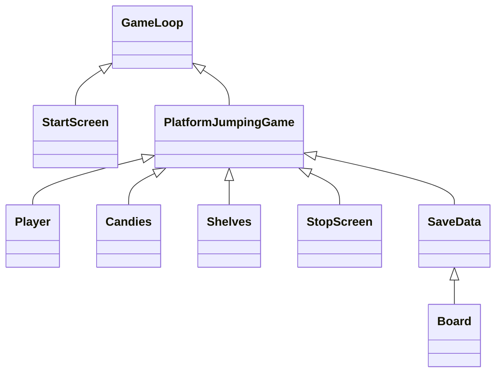
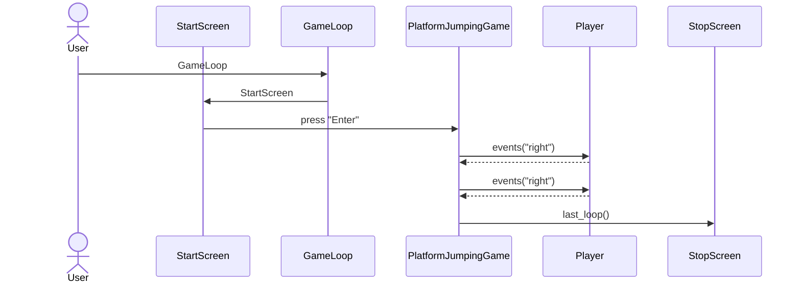

**Arkkitehtuurikuvaus**
##
Kuvaus kansioista:
- src:ssä sijaitsee käyttöliittymät ja pelin pyöritys
- objects-kansiossa sijaitsee pelin elementit: pelaaja, hyppytasot sekä karkit
- repositories-kansiossa sijaitsee tietokannan luominen. Tietokanta on toteutettu SQL-kielellä. Tietokantataulun nimi on Highscores.
Tauluun tallennetaan jokaisen pelin jälkeen tulos kerätyistä karkeista. Viisi suurinta tulosta näkyy src-kansion highscoreboard-tiedostossa.
##

**Luokkakaavio:**

**Sekvenssikaaviot:**

Alotusnäytöstä pelin lattiaraon kautta lopetukseen. (erilainen luokkakuvaukseen verrattuna, johtuen uusista muutoksista):

 

