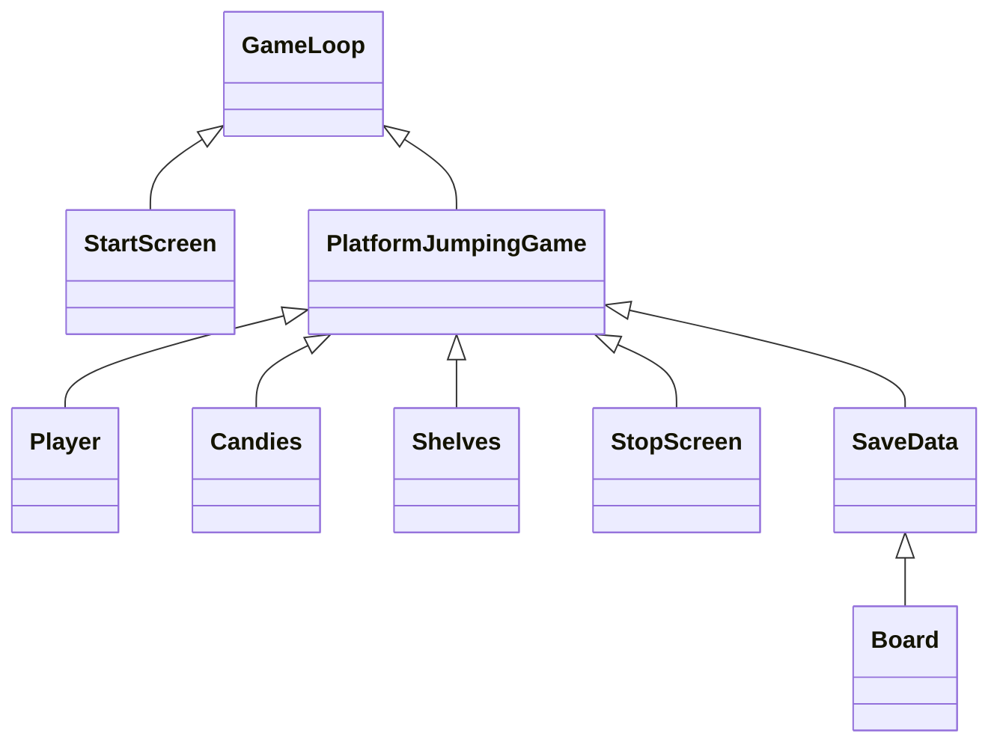

Luokkakaavio:




Sekvenssikaavio alotusnäytöstä pelin lattiaraon kautta lopetukseen. (erilainen luokkakuvaukseen verrattuna, johtuen uusista muutoksista):

```mermaid
sequenceDiagram
  actor User
  participant StartScreen
  participant GameLoop
  participant PlatformJumpingGame
  participant Player
  participant StopScreen
  User->>GameLoop: GameLoop
  GameLoop->>StartScreen
  StartScreen->>PlatformJumpingGame: press "Enter"
  PlatformJumpingGame->>Player: events("right")
  Player-->>PlatformJumpingGame: 
  PlatformJumpingGame->>Player: events("right")
  Player-->>PlatformJumpingGame: 
  PlatformJumpingGame->>StopScreen: last_loop()
   
```
 
