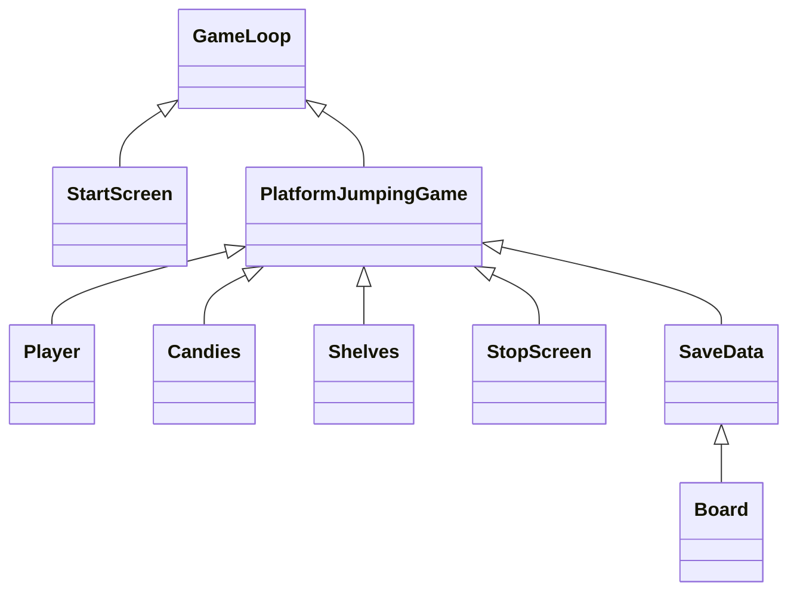
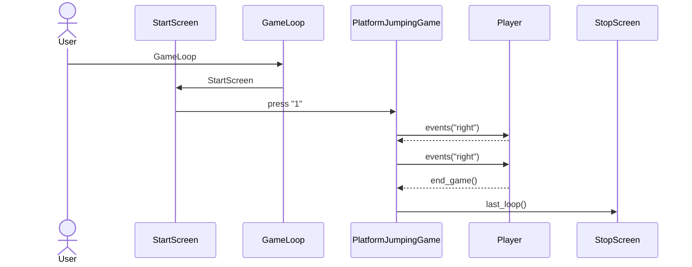

# Arkkitehtuurikuvaus

Kuvaus kansioista:
- src:ssä sijaitsee käyttöliittymät ja pelin pyöritys
- objects-kansiossa sijaitsee pelin elementit: pelaaja, hyppytasot sekä karkit
- repositories-kansiossa sijaitsee tietokannan luominen. Tietokanta on toteutettu SQL-kielellä. Tietokantataulun nimi on Highscores.
Tauluun tallennetaan jokaisen pelin jälkeen tulos kerätyistä karkeista. Viisi suurinta tulosta näkyy src-kansion highscoreboard-tiedostossa.
- images-kansiossa on pelaajaobjektin ladattu kuva, joka ladataan playerimage-tiedostoon.
##

## Luokkakaavio:



##

## Sekvenssikaaviot:

Sovelluksen pelinäkymä aloitusnäytöstä lopetusnäyttöön: (Huom! Tämä ei kuvaa tulosten tallennusta)


 
 **Karkkiin osuminen ja tulosten tallennus:**
 
 Alla oleva sekvenssikaavio kuvaa sitä, kun karkkiin osuttaan kerran jonka jälkeen peli päättyy tippumalla lattiaraosta alas, 
 jonka jälkeen tallennetaan pelin tulos.
 
 ```mermaid
sequenceDiagram
  actor User
  participant GameLoop
  participant StartScreen
  participant PlatformJumpingGame
  participant Player
  participant SaveData
  participant StopScreen
  User->>GameLoop: GameLoop
  GameLoop->>StartScreen: StartScreen
  StartScreen->>PlatformJumpingGame: press "1"
  PlatformJumpingGame->>Player: events("right")
  Player-->>PlatformJumpingGame: 
  PlatformJumpingGame->>PlatformJumpingGame: candy_collision()
  PlatformJumpingGame->>PlatformJumpingGame: score()
  Player-->>PlatformJumpingGame: end_game()
  PlatformJumpingGame->>SaveData: (self.calculator)
  SaveData->>SaveData: create_table()
  SaveData->>SaveData: store.scores()
  PlatformJumpingGame->>StopScreen: last_loop()
  ```
 
 
 
 **Tallennusnäkymä**
 
 Tallennusnäkymän sekvenssikaaviossa käsitellään vain tapahtuma, missä käyttäjä avaa pelin ja katsoo
 suurimmat tulokset.

 ```mermaid
sequenceDiagram
  actor User
  participant GameLoop
  participant StartScreen
  participant Board
  participant SaveData
  User->>GameLoop: GameLoop
  GameLoop->>StartScreen: StartScreen
  StartScreen->>Board: press "2"
  Board->>Board: board_loop()
  Board->>Board: get_scores_on_screen()
  Board->>SaveData: scores_in_order()
  SaveData->>Board: list
  ```
 
 
 
 


